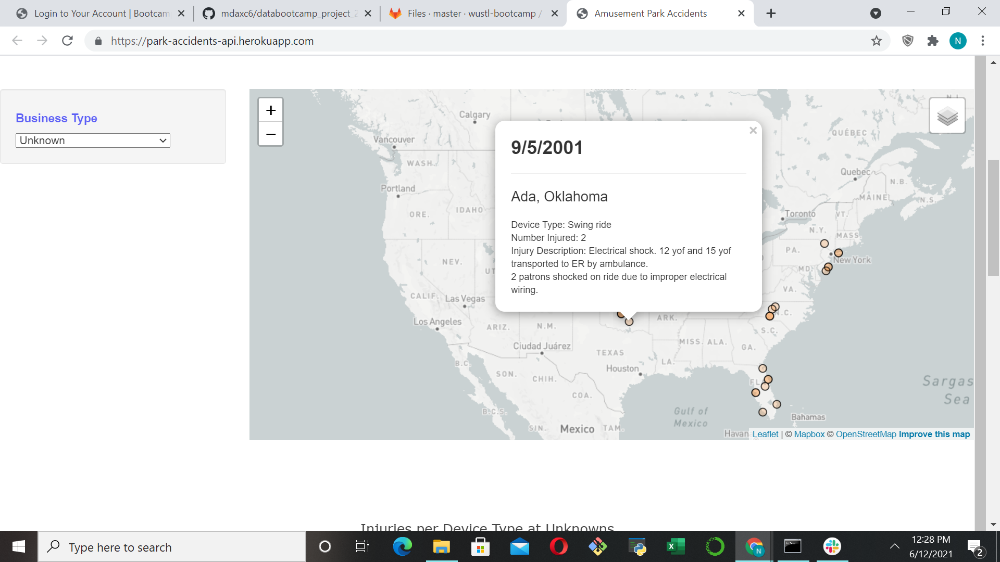

# Amusement Park Ride Safety Analysis

 

Project Proposal
-----------------------
- We have chosen to look into amusement park data to explore ride safety relationships visually, inspired by the earthquake in-class assignment using Leaflet. 
- Dataset: https://www.kaggle.com/stevenlasch/roller-coaster-accidents?select=Saferparks-dataset-legacy-v2.csv
- Final Sketch: ETL using python/pandas + SQL/SQLite --> Flask-API --> Heroku --> HTML + CSS + JavaScript and Plotly/D3 --> Leaflet map?
- Visualization plans: Leaflet map, injury category v. Manufacturer,  ride category/type v. number injured v. manufacturer v. business type, date v. number injured (saftey of coasters over time) 
- GitHub Repo: https://github.com/mdaxc6/databootcamp_project_2

-Mike: ETL, sqlite + flask, heroku, leaflet map

-Jordan: JS/plotly --> plots

-Nina: HTML/CSS, JS 

Background Work

ETL
Used Python and Pandas to format and prepare the data.
State Abbr -> Full Names
Used Google geocode API to add location info to the dataset.
Used Pandas to create sqlite database containing info.

SQLite and Flask-API
Created Flask app with 3 routes
All Accident Data
Accident Data by State
Accident Data by City
We utilized SQLAlchemy to pull data from the database, and jsonify to return a JSON format.
The main dashboard is rendered in flask via a render template.

Heroku
The flask app was pushed to Heroku with automatic deploy

Using Plotly to Plot Visualizations

HTML
